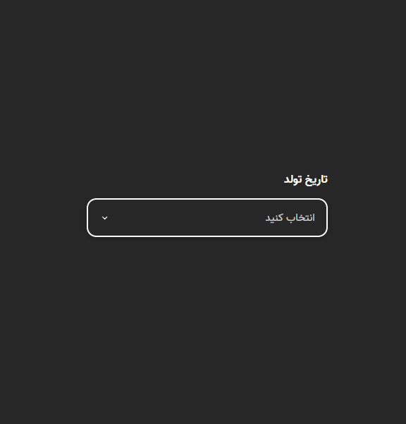

# **Persian Date Picker**

**A lightweight, customizable Date Picker component built with HTML, CSS, and JavaScript. This Date Picker provides a user-friendly interface for selecting dates and can be easily integrated into any web project.**

<div align="center">
  
</div>

## Table of Contents

- [Features](#features)
- [Installation](#installation)
- [Usage](#usage)
- [Contributing](#contributing)
- [Credits & Contact](#credits--contact)

## Features

- **Simple Integration: Easy to add to any webpage with minimal setup.**
- **Customizable Design: Modify the look and feel with your own CSS.**
- **Lightweight: No dependencies on external libraries or frameworks.**
- **Cross-Browser Compatibility: Works on all modern browsers.**
- **Responsive Design: Make the datepicker responsive, so it adapts seamlessly to various screen sizes, especially for mobile users**

## Installation

### To integrate the button component into your project, follow these steps:

1. **Download the Files**: Clone or download the repository to your local machine.
2. **Serve the `index.html` File**: To view the component in action, you’ll need to run a local server. Here are a few options:

   - **Using Live Server**: If you're using Visual Studio Code, you can install the [Live Server extension](https://marketplace.visualstudio.com/items?itemName=ritwickdey.LiveServer). Simply open the `index.html` file and click on "Open with Live Server."

   - **Using XAMPP**: Download and install [XAMPP](https://www.apachefriends.org/index.html). Move the project folder to the `htdocs` directory, then start the Apache server from the XAMPP Control Panel. Access the slider via `http://localhost/your-folder-name/index.html`.

   - **Using Python**: If you have Python installed, navigate to your project directory in the terminal or command prompt and run:
     ```bash
     python -m http.server
     ```
     This will start a simple HTTP server, which you can access at `http://localhost:8000/index.html`.

## Usage

### DatePicker Configuration Parameters:

- **Label**: An name for label `(string)`.
- **Listener**: A callback function that receives the selected item.

### Example Use Case:

Here’s an example of how you can integrate the `DatePicker` component into your project:

1. **Import the `DatePicker` component** in a javascript file.

```javascript
import { DatePicker } from "./Widget/Date_Picker/date_picker.js";
```

2. Create and append the `DatePicker`:

```javascript
// DatePicker label
const DatePickerLabel = "تاریخ تولد";

// Create the DatePicker
const BirthDayDatePicker = DatePicker(DatePickerLabel, (slectedDate) => {
  handleSelection(slectedDate);
});

// Handle selection
function handleSelection(SelectedDate) {
  console.log(SelectedDate);
}

// Append dropdown to the DOM
document.body.appendChild(BirthDayDatePicker);
```

## Customization

**You can customize the appearance of the datepicker using CSS. The following class names can be styled:**

### Basic Classes

- `.DatePicker`: Main container for the datepicker.
- `.DatePickerLabel`: Label for the datepicker.
- `.DatePickerTitle`: Clickable title area.
- `.DatePickerBody`: Body of the datepicker that contains year, month, and day selections.
- `.DatePickerBtn`: Button for confirming date selection.

### Icon Classes

- `.DatePickerTitleIcon`: Icon in the title area, typically an arrow.
- `.ArrowBtn`: Up and down scroll buttons for navigating through lists.

### List Classes

- `.DatePickerContent`: Container for the list and scroll buttons.
- `.DatePickerBodyList`: List container for years, months, and days.
- `.ItemContainer`: Container for individual items in the list.
- `.Active`: Highlighted state for the selected item.

## Contributing

_Contributions are welcome!_

## Credits & Contact

**Creator**: Subhaan Yaghouti

**Contact**: If you have any questions or feedback, feel free to reach out via [yaghouti.1831@gmail.com](mailto:yaghouti.1831@gmail.com) or on Instagram [@subhaan_yaghouti](https://www.instagram.com/subhaan_yaghouti?igsh=bmE3ZTl1bGkwaW50).
